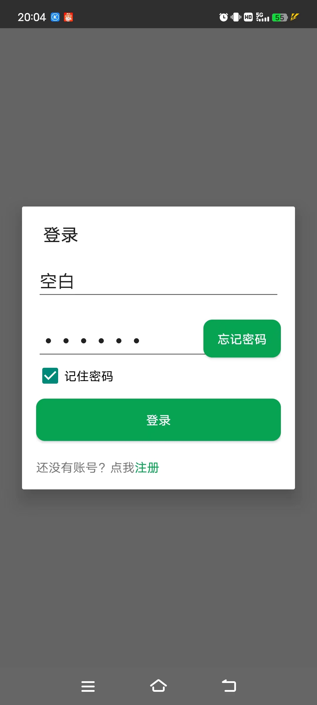
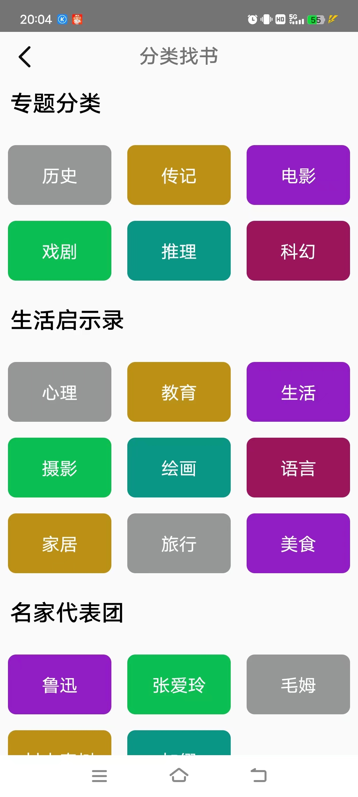
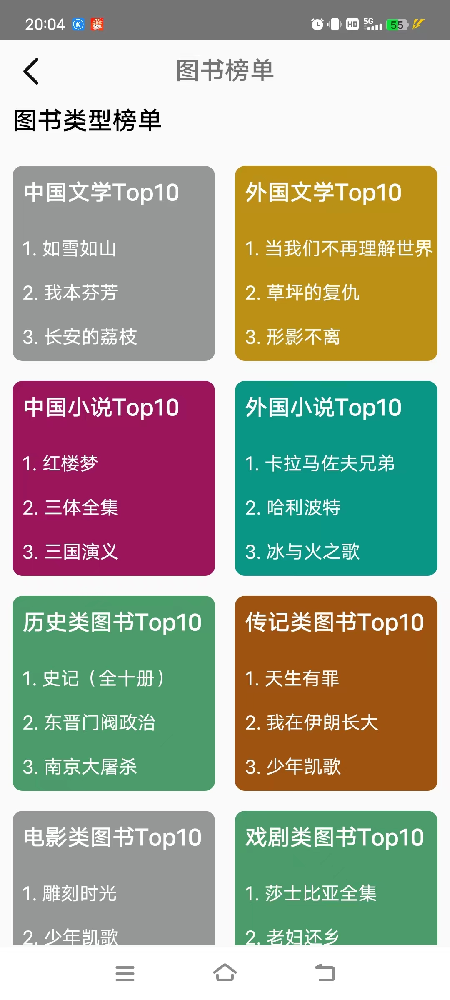
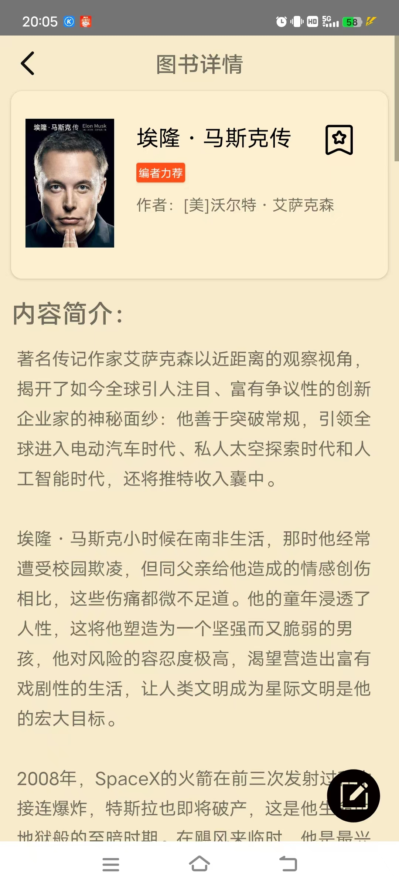

# 项目介绍

本项目为南京大学软件学院人机交互项目——仿豆瓣的书籍信息、评论汇总安卓App

emmm，看了其他组的项目，觉得其实完成度并不是很高，很多同学是很富有技术力和想法的。

时间仓促，并没有来得及配备后端，基本所有数据都是我自己手敲进去的，用Sqlite数据库暂时顶着进行读写操作。

效果图如下：

登录注册界面：

首页界面：

个人主页：可以查看用户收藏、历史书评、帮助反馈、退出登录

分类搜索：依据不同种类进行书籍结果的搜索

图书榜单：各类书籍的排行榜

图书资讯：查询全新速递的读书相关资讯

书单推荐：书籍合集书单

图书详情页：图书的相关详情，可以发布评论，点击收藏

搜索界面：依据书名或作者名进行搜索，做了一个简单的模糊搜索

以上就是我人机交互大作业的全部。
